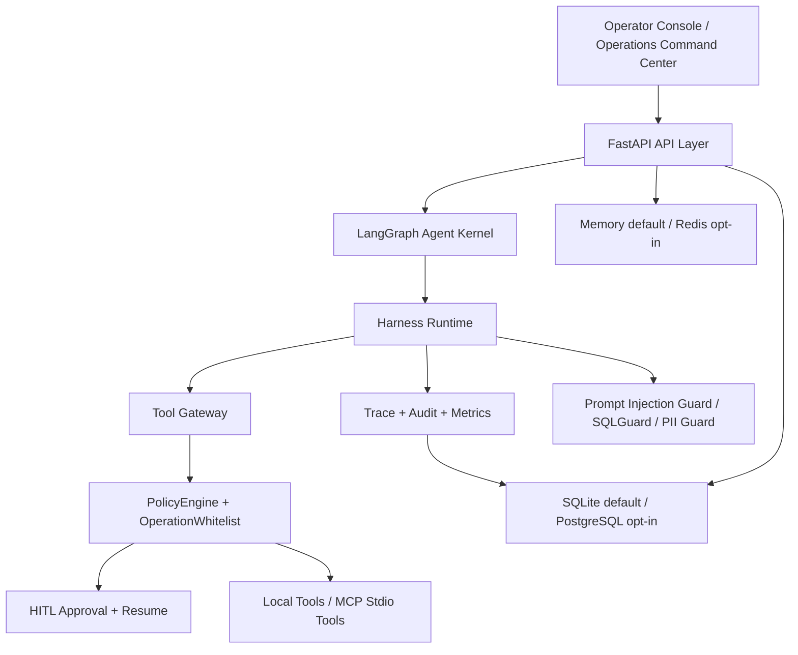

# Project B

[](https://github.com/wyjhfl/project-b-multi-agent/actions/workflows/ci.yml)
[](pyproject.toml)
[](app/main.py)
[](frontend/package.json)

生产级 Agent Runtime 工程化原型，面向企业内网受控试点场景。项目重点不是堆叠一个聊天 Demo，而是把 Agent 的工具调用、审批恢复、审计追踪、评测回归、配置门禁和运营台做成可验证的工程闭环。

## 面试快速入口（当前推荐阅读）

本项目适合作为简历项目的定位：**生产级 Agent Runtime 工程化原型**。面试时重点讲清楚三件事：为什么先做 Runtime 治理而不是裸调 LLM，如何保证高风险工具调用可审批可审计，以及如何用测试和只读证据链证明系统边界。

推荐阅读：

- `docs/resume_interview_optimization_pack_v50.md`：简历写法、2 分钟讲解、面试追问和后续优化路线。
- `docs/interview_demo_readiness_v50.md`：面试前只读自检 runbook。
- `docs/interview_guide.md`：更完整的架构问答材料。

推荐演示命令：

```powershell
powershell -NoProfile -ExecutionPolicy Bypass -File scripts\codex_python.ps1 scripts\interview_demo_readiness.py
powershell -NoProfile -ExecutionPolicy Bypass -File scripts\controlled_pilot_demo_landing.ps1 -EnvPath local\production_landing.staging.env
powershell -NoProfile -ExecutionPolicy Bypass -File scripts\controlled_pilot_console_up.ps1 -BackendPort 8000 -FrontendPort 3004
```

演示入口：

- Operations Command Center: `http://127.0.0.1:3004/operations`
- 重点展示：Landing Command Center、Evidence Chain、Review Reasons、Operator Guidance。

当前边界：

- `public_production_direct_launch=No-Go`
- 真实业务系统暂未接入，当前展示 demo read-only 受控试点路径。
- 不宣称公网生产可直接上线。
- 不宣称真实业务系统生产验收完成。
- 不提交、不展示任何 API key、token、连接串或 prompt 原文。

## 项目定位

Project B 是一个 Harness-native 运营中台 Agent 系统。它把 Agent 执行链路拆成清晰的工程边界：

- **Tool Gateway**：统一管理本地工具和 MCP 工具，真实 MCP 只在显式配置 allowlist 后进入。
- **PolicyEngine**：在工具调用前做风险分级，低风险放行，高风险进入人工审批。
- **HITL 审批恢复**：审批记录、payload 完整性校验和 resume 过程分离，避免审批后被篡改。
- **Audit / Trace / Metrics**：执行事件、审计日志和运行指标分层记录，支持运营台只读查看。
- **NL2SQL Guardrail**：自然语言到 SQL 的链路包含 schema pruning、SQLGuard、只读执行和结果格式化。
- **Production Guard**：生产配置门禁、CORS、安全响应头、限流、OIDC 骨架、PostgreSQL/Redis opt-in 检查。
- **Operations Command Center**：把受控试点状态、证据链、阻断项和操作员指引集中到前端页面。

本项目默认保持 fake/offline，可在没有真实 LLM、真实 MCP Server、真实业务系统、真实 PostgreSQL 和真实 Redis 的情况下完成本地验证。

## 架构总览



## 核心能力

| 能力 | 已落地内容 | 面试讲法 |
| --- | --- | --- |
| Agent Runtime | ContextAssembler、HookPipeline、PolicyEngine、TraceRecorder、AuditRecorder | Agent 行为必须通过管线，不能裸调模型 |
| 工具网关 | local tools、FakeMCPClient、StdioMCPClient、MCP allowlist | 统一注册、统一策略、统一审计 |
| 审批恢复 | ApprovalStore、ApprovalResumeService、payload 完整性校验 | 高风险操作先暂停，再由审批结果恢复 |
| 安全基线 | Prompt injection guard、OperationWhitelist、SQLGuard、PII guard | 用规则和边界先挡住确定性风险 |
| 可观测性 | Audit、Trace、Metrics、Operations Summary API | 运营人员能看到证据链和阻断原因 |
| 生产门禁 | deployment guard、prod env check、compose config check | 配置错误返回结构化结果，不伪造成通过 |
| 前端运营台 | Tasks、Approvals、Audit、Metrics、Tools、NL2SQL、Operations | 面试演示可以直接看系统状态 |
| 面试资产 | resume pack、readiness script、README 展示入口 | 简历、讲解、演示和验证材料一致 |

## 快速开始

后端：

```powershell
powershell -NoProfile -ExecutionPolicy Bypass -File scripts\codex_python.ps1 -m pip install -e ".[dev]"
powershell -NoProfile -ExecutionPolicy Bypass -File scripts\codex_python.ps1 scripts\init_demo_db.py
powershell -NoProfile -ExecutionPolicy Bypass -File scripts\codex_python.ps1 scripts\start_app.py
```

前端：

```powershell
cd frontend
npm ci
npm run lint
npm run build
npm run dev
```

Docker 配置检查：

```powershell
docker compose config
powershell -NoProfile -ExecutionPolicy Bypass -File scripts\codex_python.ps1 scripts\prod_compose_required_env_check.py
```

## 验证命令

CI 同级验证建议：

```powershell
powershell -NoProfile -ExecutionPolicy Bypass -File scripts\codex_python.ps1 scripts\production_landing_text_quality_check.py
powershell -NoProfile -ExecutionPolicy Bypass -File scripts\codex_python.ps1 -m pytest -q
cd frontend
npm ci
npm run lint
npm run build
```

面试前验证建议：

```powershell
powershell -NoProfile -ExecutionPolicy Bypass -File scripts\codex_python.ps1 scripts\interview_demo_readiness.py
powershell -NoProfile -ExecutionPolicy Bypass -File scripts\codex_python.ps1 -m pytest tests\test_readme_interview_entry_v50.py tests\test_interview_demo_readiness_v50.py tests\test_resume_interview_pack_v50.py -q
```

## 项目结构

```text
app/              FastAPI、Agent Runtime、工具网关、策略、安全、存储和 API
frontend/         Next.js 运营台和演示界面
scripts/          只读验收、配置门禁、演示启动、证据生成脚本
tests/            后端、脚本、配置、前端展示口径和生产门禁测试
docs/             架构、runbook、面试材料、生产落地边界和验收文档
data/evaluation/  NL2SQL、多 Agent、BadCase 评测数据
alembic/          PostgreSQL opt-in schema migration
```

## 配置边界

默认配置面向本地开发和受控演示：

- `LLM_PROVIDER=fake`
- `MCP_MODE=fake`
- `AUTH_ENABLED=false`
- `RBAC_ENABLED=false`
- `STORAGE_BACKEND=sqlite`
- `REDIS_ENABLED=false`
- `RATE_LIMIT_BACKEND=memory`

真实集成必须显式 opt-in，并提供外部 secret manager 或进程环境变量。仓库只保留 `.env.example` 和 `.env.production.example`，不保留任何真实密钥。

## GitHub 展示建议

面试官打开仓库后建议按这个顺序看：

1. README 的项目定位和架构图。
2. `frontend/src/app/operations/page.tsx` 看 Operations Command Center。
3. `app/harness/gateway/tool_gateway.py`、`app/harness/policy/engine.py`、`app/services/approval_resume.py` 看核心治理链路。
4. `tests/` 看回归覆盖和边界测试。
5. `docs/resume_interview_optimization_pack_v50.md` 看面试讲解材料。

## Roadmap

短期继续优化：

- UI：继续打磨 Operations Command Center 的信息密度、状态层级和移动端可读性。
- 技术：补强真实 PostgreSQL/Redis 受控 smoke 证据，但默认路径仍保持离线。
- 功能：围绕业务系统只读接口设计最小 adapter，仍不写业务数据。
- 面试资产：补齐 3 分钟讲解稿、10 分钟深挖路线和截图级演示材料。

## 重要声明

Project B 是 production-grade engineering prototype，适合展示企业级 Agent 工程化能力和内网受控试点落地思路。它不是公网生产即插即用系统；真实 LLM、真实 MCP Server、真实业务系统、生产级 SSO/OIDC、多租户和复杂 BI 的生产验收仍需要独立环境、真实凭据、人工复核和上线审批。
