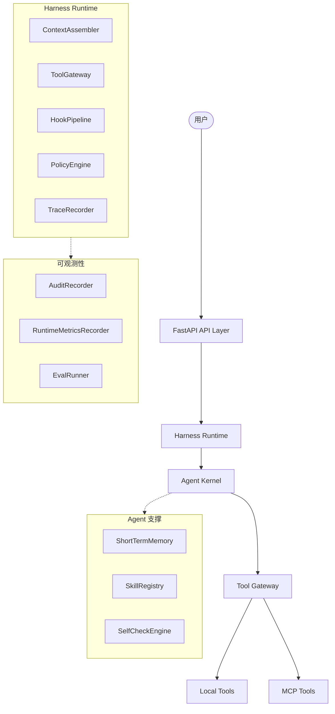
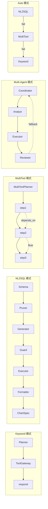
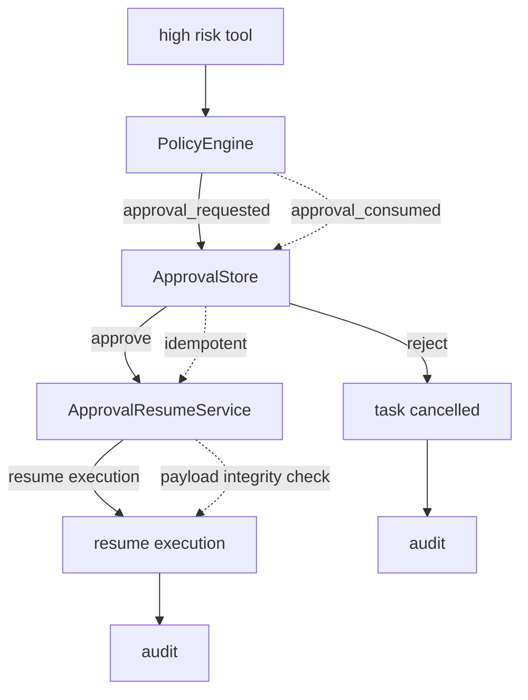
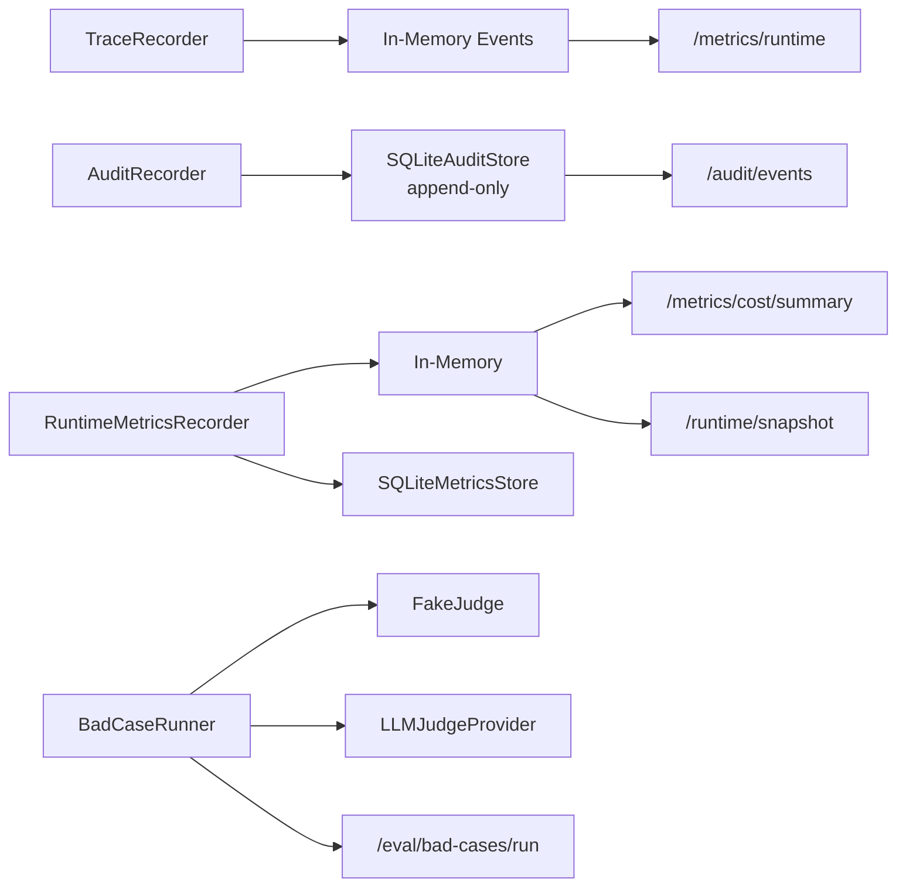

# Project B: Harness-native 运营中台 Agent — 架构文档 v1.0

## 1. 总架构图

**流程说明：** 用户通过 FastAPI API Layer 发起请求，请求进入 Harness Runtime 后，由 ContextAssembler 组装上下文、HookPipeline 执行钩子、PolicyEngine 校验策略、TraceRecorder 记录链路。Agent Kernel 负责核心推理与决策，通过 Tool Gateway 调用本地工具或 MCP 远程工具。侧边的可观测性模块（AuditRecorder / RuntimeMetricsRecorder / EvalRunner）以旁路方式采集审计、指标与评测数据；Agent 支撑模块（ShortTermMemory / SkillRegistry / SelfCheckEngine）为 Kernel 提供短期记忆、技能注册与自检能力。

---

## 2. 任务执行链路

**流程说明：**

- **Keyword 模式：** 最简单的路径——Planner 直接匹配关键词，通过 ToolGateway 调用工具后返回结果，适用于高确定性的查询场景。
- **NL2SQL 模式：** 自然语言转 SQL 的完整管线：先加载 Schema，经 Pruner 裁剪无关表，Generator 生成 SQL，Guard 做安全校验，Executor 执行查询，Formatter 格式化结果，最后 ChartSpec 生成可视化图表规格。
- **MultiTool 模式：** MultiToolPlanner 将复杂任务拆解为多步骤链式执行，步骤间通过 `depends_on` 声明依赖、`$var` 传递变量，实现有向无环的编排。
- **Multi-Agent 模式：** Coordinator 协调 Analyst（分析）、Executor（执行）、Reviewer（审核）三个角色，Reviewer 不通过时可 fallback 回 Coordinator 重新规划。
- **Auto 模式：** 自动降级策略——优先尝试 NL2SQL，失败后降级到 MultiTool 编排，再失败则回退到 Keyword 模式，确保系统始终能给出响应。

---

## 3. HITL 审批链路

**流程说明：** 当工具被标记为高风险时，PolicyEngine 拦截执行并向 ApprovalStore 写入审批请求。审批人可选择通过或拒绝：通过后 ApprovalResumeService 恢复执行，拒绝则取消任务。两种路径均会写入审计日志。关键保障机制包括：`approval_consumed` 确保审批单据一次性消费、`idempotent` 保证重复提交幂等、`payload integrity check` 在恢复执行前校验请求体未被篡改。

---

## 4. Runtime Observability

**流程说明：**

- **TraceRecorder** 将执行链路事件写入内存，供 `/metrics/runtime` 端点实时查询。
- **AuditRecorder** 以 append-only 方式将审计事件持久化到 SQLiteAuditStore，通过 `/audit/events` 暴露查询接口，确保审计记录不可篡改。
- **RuntimeMetricsRecorder** 同时维护内存指标（低延迟读取）和 SQLiteMetricsStore（持久化），分别支撑 `/metrics/cost/summary`（成本汇总）和 `/runtime/snapshot`（运行时快照）端点。
- **BadCaseRunner** 支持两种评判器：FakeJudge（基于规则的快速评判）和 LLMJudgeProvider（基于大模型的深度评判），通过 `/eval/bad-cases/run` 触发坏例回归评测。
